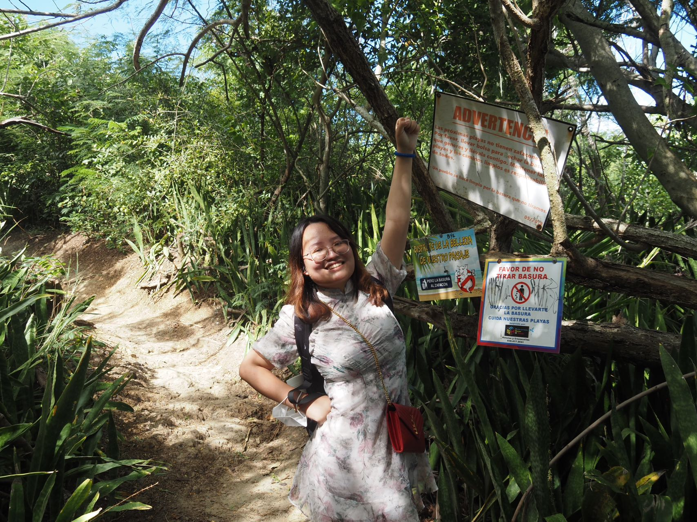

# Hello! How are you today!

* I am Suning, a 2nd year master of public health student at Columbia University, majoring in Biostatistics.
* I graduated from Fudan University, Shanghai, China, with a Bachelor of Medicine degree, focusing in Basic Medical Science (Biomedicine)
* Previously I have several internship experiences in Consulting firm, Private Equity and Health insurance company
* Currently, I am a research assistant in Center of Health Policy, School of Nursing, Columbia University
* My research interest is pharmaceutical economics and outcome
* My toolbox includes SAS, STATA, R, Tableau, Mplus, SPSS, Excel, PowerPoint, Photoshop, Xmind

A nice trip in Puerto Rico!

# A fun fact for me

* I am a big fan of Genshin Impact. I just got Nahida yesterday!

* My favorite character is Al Haitham

# Link to page within the site

[My Resume](about.html)
[Dashboard](Dashboard.html)